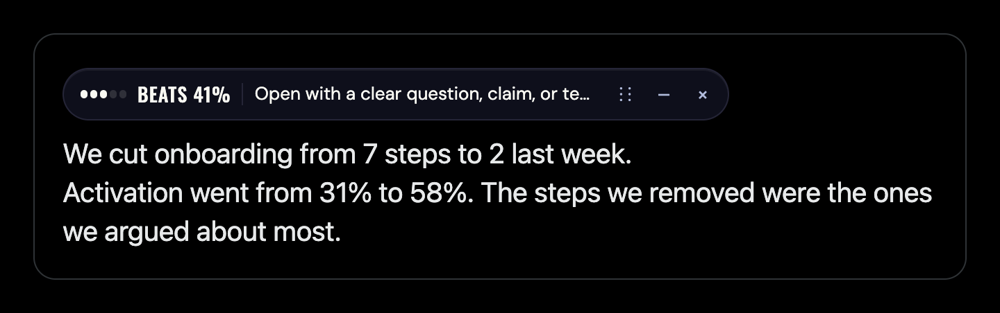

# Scoreboar Twitter/X Virality

Scoreboar is the original local-first Chrome MV3 extension that adds compact scoring labels to X/Twitter timeline posts and lightweight hints while drafting a post. This public package uses the same extension scripts, DOM detection, popup, icons, styles, and build pipeline as the working private extension; the only publishing-specific addition is a Hugging Face download script for the large ONNX model assets.



## What it does

- Adds one compact badge per detected `article[data-testid="tweet"]` on `https://x.com/*` and `https://twitter.com/*`.
- Adds debounced composer hints for X post textareas/contenteditable composer boxes.
- Composer scoring passively includes attached-media state plus current-account handle/follower/following/post/verified metadata when X has already exposed it in the page DOM or loaded state.
- Passively reads author metadata only when X has already loaded it into same-page GraphQL responses.
- Runs local ONNX inference in a Chrome offscreen document.
- Keeps model, tokenizer, ONNX Runtime Web, and WASM assets packaged locally under `dist/`.

It has no backend, no telemetry, no auth handling, no cloud sync, no extra X API/profile probing, and no runtime CDN/model fetches.

## Install in Chrome

```bash
npm install
npm run build:hf
```

Then:

1. Open `chrome://extensions`.
2. Enable **Developer mode**.
3. Click **Load unpacked**.
4. Select this repo’s `dist/` folder.
5. Open `https://x.com` or `https://twitter.com`.

## Hugging Face model download

Large model files are not committed to git. `npm run build:hf` downloads the reference model assets from Hugging Face before running the original extension build.

Default model repo:

```text
siimh/scoreboar-twitter-x-virality
```

Useful commands:

```bash
npm run download:model
npm run build:hf
```

Optional pinning:

```bash
SCOREBOAR_HF_REPO=siimh/scoreboar-twitter-x-virality \
SCOREBOAR_HF_REVISION=<commit-sha-or-tag> \
npm run build:hf
```

For private or gated repos, set `HF_TOKEN` or `HUGGING_FACE_HUB_TOKEN`. Never commit tokens.

The download script writes the files into the exact paths expected by the original build:

```text
artifacts/model/v5-full.onnx
model/v5-source/tokenizer/tokenizer.json
```

The original build then packages them as:

```text
dist/extension/assets/model/v5-full.onnx
dist/extension/assets/tokenizer/tokenizer.json
```

The stable runtime filename is `v5-full.onnx`; this file contains the final/latest validated v7-lineage export.

## API example

The repo also includes a tiny Express service in `examples/express-service/` for people who want to run the ONNX model behind their own API instead of inside Chrome. It uses `onnxruntime-node`, the same tokenizer, and the same metadata preprocessing as the extension.

```bash
npm run download:model
cd examples/express-service
npm install
npm run build
npm start
```

Then score text with:

```bash
curl -s http://localhost:8787/score \
  -H 'content-type: application/json' \
  -d '{"text":"I built a tiny local model that tells you when your tweet is probably dead.","metadata":{"hasMedia":false}}'
```

This is only an example wrapper. The Chrome extension still runs locally and does not call this API.

## Development

```bash
npm run typecheck
npm test
npm run build:hf
npm run assert:dist
npm run assert:manifest
npm run assert:no-remote-assets
```

## Model and data summary

- Runtime artifact: `v5-full.onnx` stable filename containing the final/latest validated v7-lineage model export.
- Base encoder: `answerdotai/ModernBERT-base`.
- Architecture: shared ModernBERT text encoder + 12-field metadata fusion + feature heads + 5-way ordinal outcome head.
- Approximate training corpus: **~60K Twitter/X.com posts total**.
  - **~50K viral/high-engagement posts**.
  - **~10K random/baseline posts**.
  - Refreshed with recent posts from roughly the **last 18 months**.
- Grok/teacher enrichment targets: **20 total auxiliary targets**: **12 numeric scores**, **5 boolean flags**, and **3 categorical labels**.
- Runtime/browser ONNX exposes the 5-way outcome head plus **12 numeric** and **5 boolean** feature heads.
- Validation snapshot: `58.73%` exact 5-bucket accuracy and `98.34%` within ±1 bucket.

Enriched shape, in plain terms:

- **Inputs at runtime**: post text plus **12 metadata values**: `has_media`, `created_at_hour_sin`, `created_at_hour_cos`, `created_at_day_sin`, `created_at_day_cos`, `log_author_followers`, `log_author_following`, `log_author_tweets`, `author_verified`, `hashtag_count`, `mention_count`, `url_count`.
- **Main output**: 5 performance buckets: `very_low`, `low`, `medium`, `high`, `very_high`.
- **Auxiliary numeric outputs**: `virality_score`, `hook_quality`, `clarity_score`, `novelty_score`, `emotional_intensity`, `controversy_level`, `shareability_score`, `conversation_potential`, `authenticity_score`, `urgency_level`, `call_to_action_strength`, `trend_alignment`.
- **Auxiliary boolean outputs**: `is_rage_bait`, `is_clickbait`, `is_ai_slop`, `needs_context`, `has_clear_takeaway`.
- **Categorical labels used during training**: `primary_emotion`, `target_audience`, `content_type`. These were training supervision; the browser runtime does not need to show them.

See `MODEL_CARD.md` for the full model card.

## Project layout

```text
manifest.config.ts             source manifest used by original build
extension/                     original MV3 entrypoints, popup, icons, page listener
src/                           original DOM detection, scoring UI, guardrails, runtime contracts
scripts/build-extension.mjs    original extension build script
scripts/download-hf-assets.mjs Hugging Face model/tokenizer downloader
examples/express-service/      optional Node.js API wrapper for the ONNX model
fixtures/                      local X-like fixture pages for tests
tests/                         original unit/integration tests
MODEL_CARD.md                  Hugging Face model documentation
```

## Guardrails

- Runtime/model assets are packaged locally under `dist/extension/assets/`.
- The extension does not load scripts, WASM, tokenizers, or model files from remote URLs at runtime.
- The extension does not make X API requests.
- Scoreboar may passively parse already-loaded same-page X GraphQL responses for author metadata.
- The score is directional. Use ranges/buckets such as `medium–high`, not exact truth claims.
