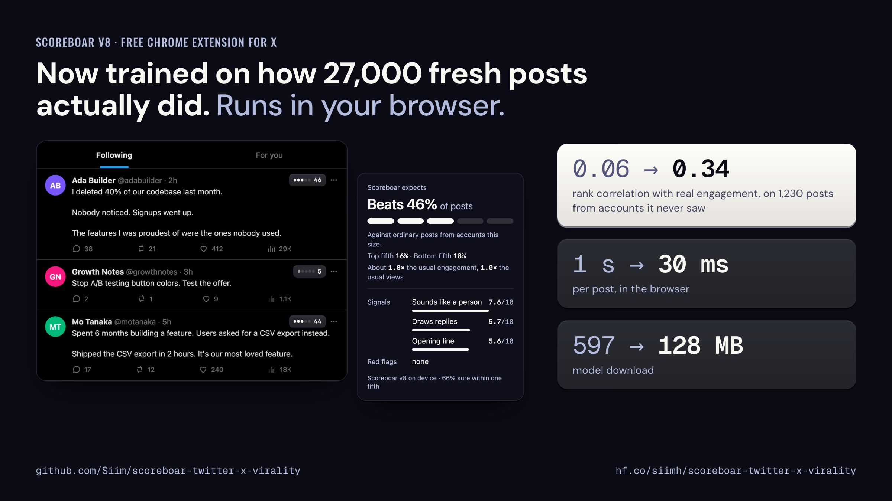
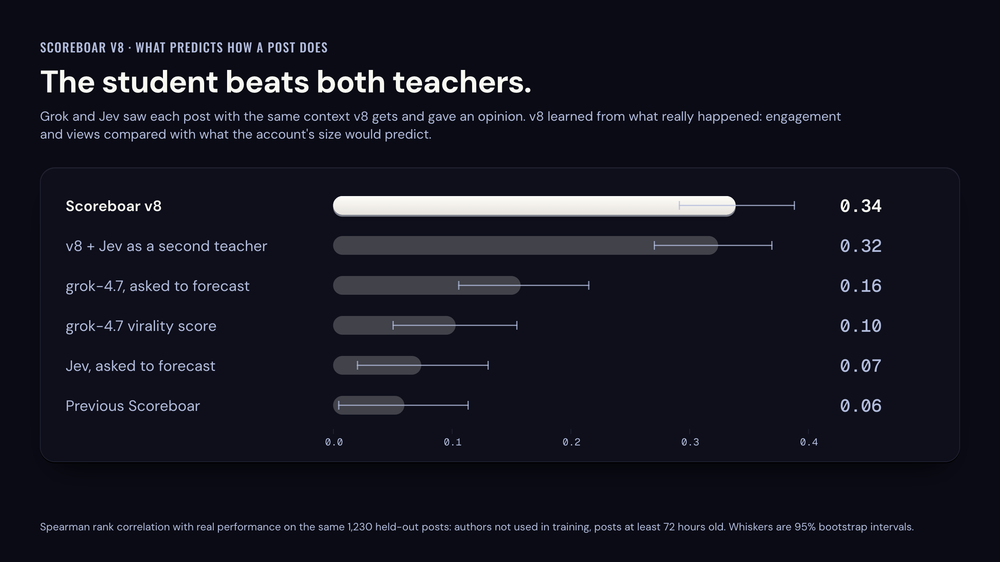

# Scoreboar for X

Scoreboar is a Chrome extension that scores posts on X while you read and while you write. Every post in the timeline gets a small badge, and the composer shows a live score as you type. The model runs inside the extension. Nothing is sent anywhere.




The score answers one question: compared with ordinary posts from accounts this size, how is this post likely to do? "Beats 46% of posts" means the model expects it to do better than 46% of them once account size is accounted for. Open the badge for the chance of landing in the top or bottom fifth, expected engagement and views as multiples of the account's usual, and what the model noticed about the text.

## What's new in v8

- **Trained on outcomes.** v8 learned from the real engagement and views of 27,009 fresh posts, relative to what each author's reach predicts. Earlier versions copied an LLM's opinion of the text, which barely predicts how posts do. On 1,230 held-out posts from unseen authors, rank correlation with real performance went from 0.06 to 0.34.
- **Calibrated numbers.** The headline is a percentile, and the fifth probabilities are calibrated (expected calibration error 0.014). The old "medium–high" ranges are gone.
- **Faster and smaller.** A 32M-parameter [Ettin](https://huggingface.co/jhu-clsp/ettin-encoder-32m) encoder instead of ModernBERT-base: 30 ms per post instead of about a second, and 128 MB instead of 597 MB.
- **Reads more of the post.** Photo vs. video, quotes, link cards, account age and likes given, all from data X has already loaded into the page. The draft score uses the same inputs the published post will get.
- **x11.social design.** Raised keys, a five-step scale, light and dark themes that follow X's display setting, and motion that respects Reduce motion.

The chart below compares v8 with the LLM teachers it learned from and with the previous release. [MODEL_CARD.md](MODEL_CARD.md) has the full evaluation, the training data, and what did not work.



## Install

The quickest way: download `scoreboar-v8-extension.zip` from the [latest release](https://github.com/Siim/scoreboar-twitter-x-virality/releases/latest) and unzip it. Or build it yourself:

```bash
npm install
npm run build:hf
```

Then in Chrome:

1. Open `chrome://extensions`.
2. Turn on **Developer mode**.
3. Click **Load unpacked** and pick the unzipped folder (or this repo's `dist/` folder).
4. Open <https://x.com>.

The first score waits a moment while the model loads. After that each post takes about 30 ms.

## Model files

The model is not in git. `npm run build:hf` downloads it from [siimh/scoreboar-twitter-x-virality](https://huggingface.co/siimh/scoreboar-twitter-x-virality) at the revision pinned in `model-assets.json`, checks each file's SHA-256 against the pin, and refuses anything that does not match. The pins travel with the source, so a build always gets the model that `src/contracts.ts` was written for.

| File | Goes to |
|---|---|
| `scoreboar-v8.onnx` | `artifacts/model/scoreboar-v8.onnx` |
| `scoreboar-v8.json` | `artifacts/model/scoreboar-v8.json` |
| `tokenizer.json` | `artifacts/model/tokenizer.json` |

To try another revision, set `SCOREBOAR_HF_REPO` and/or `SCOREBOAR_HF_REVISION`. Hash checks are skipped for overridden downloads, so only point these at repos you trust.

## Use the model outside the extension

`examples/express-service/` runs the same model behind a small HTTP API with ONNX Runtime for Node. It prepares posts with the extension's own tokenizer and feature contract, so a post sent to it gets the inputs it would get in Chrome.

```bash
npm run download:model
cd examples/express-service
npm install
npm run build
npm start
```

Send a post to `POST /score` as JSON with `text` and `metadata`:

```bash
curl -s http://127.0.0.1:8787/score \
  -H 'content-type: application/json' \
  -d '{"text":"We cut onboarding from 7 steps to 2 last week. Activation went from 31% to 58%.","metadata":{"createdAt":"2026-09-22T14:00:00Z","hasMedia":false,"authorFollowers":1200,"authorFollowing":310,"authorTweets":4100,"authorVerified":false}}'
```

`metadata` takes the same camelCase fields the extension sends (`MetadataPreprocessInput` in `src/contracts.ts`). Leave out what you do not know: the contract marks a missing value as unknown instead of treating it as zero. Send the author's stats when you have them, because the score is relative to account size.

The main fields in the response:

- `performance.percentile`: 0 to 1, the number behind "Beats N% of posts".
- `performance.engagementMultiple` and `performance.reachMultiple`: expected engagement and views as multiples of what the account usually gets.
- `probabilities`: the calibrated chance of each fifth, `very_low` to `very_high`.
- `numericScores` and `booleanScores`: the explanation heads, scores from 0 to 10 and flag chances from 0 to 1.

The example's README has the full request and response. The extension does not use this service; it runs the model itself.

## Development

```bash
npm run typecheck
npm test
npm run build:hf
npm run assert:dist
npm run assert:manifest
npm run assert:no-remote-assets
npm run model:bench:wasm   # per-post latency in Chromium, writes reports/
```

## How it works

- `src/dom-detection.ts` finds posts and the composer on the page.
- `src/contracts.ts` reads text, media, quotes, links and time from the DOM and turns them into the model's inputs (feature contract v2). `fixtures/feature-contract-v2.json` pins it to the Python trainer.
- `extension/page-listener.ts` reads author stats and post facts from X's own GraphQL responses as the page loads them. The extension makes no requests to X.
- `extension/offscreen.ts` runs the ONNX model with ONNX Runtime Web (WASM, multithreaded when the page is cross-origin isolated).
- `src/feed-badges.ts` and `src/composer-hints.ts` draw the badge, the details popover and the composer score.

```text
manifest.config.ts             extension manifest source
extension/                     MV3 entry points, popup, icons, fonts, page listener
src/                           DOM reading, feature contract, scoring UI, theme
scripts/                       build, asserts, Hugging Face download, benchmark
examples/express-service/      optional Node HTTP API around the same model
fixtures/                      X-like pages and the feature-contract fixture
tests/                         unit and integration tests
MODEL_CARD.md                  model documentation (also the Hugging Face card)
```

## Privacy

- The model, tokenizer, ONNX Runtime and fonts are packaged in `dist/`. Nothing is loaded from a remote URL at runtime.
- No backend, no telemetry, no account, no X API calls.
- Author stats come only from responses X has already loaded into the page.

## Limits

The score is a forecast with real uncertainty: rank correlation 0.34 is good for comparing drafts and catching weak ones, not for promises. It does not look at images or video content, it is mostly English, and it knows X as of September 2026. See [MODEL_CARD.md](MODEL_CARD.md).

## License

MIT. The base encoder, Ettin-encoder-32m, is MIT licensed. Bundled fonts (DM Sans, Geist Mono, Oswald) are under the SIL Open Font License; the license files sit next to them in `extension/assets/fonts/`. The top-level domain lists in `src/x-autolink.ts` come from the Public Suffix List and are used under MPL-2.0.
